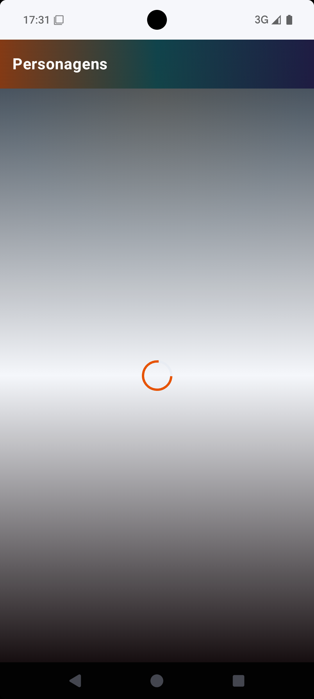
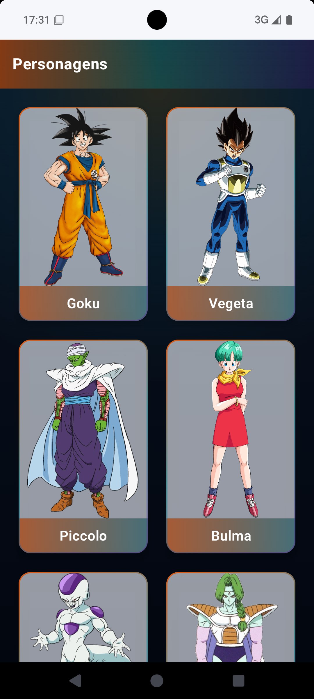
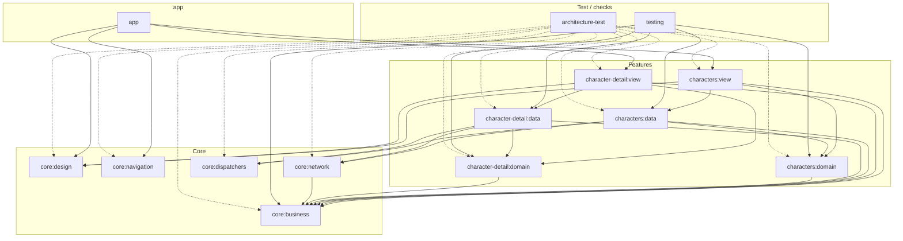

# DragonBall-Compose

Sample Android app that lists **Dragon Ball** characters from a remote API, supports **paged loading**, and opens a **detail** screen with **Character** and **Planet** tabs. The UI is built with **Jetpack Compose**, **Material 3**, and **Navigation 3**. Networking uses **Retrofit** with **Gson**, DI uses **Hilt**, and asynchronous work uses **Kotlin Coroutines**.

## What this project does

- **Characters list**: grid of cards (image + name) with loading, error, and empty states; manual **load-more** pagination (no Paging 3 library).
- **Character detail**: scaffold with back navigation, **Character** tab (stats, description) and **Planet** tab (origin planet or “unavailable” copy).
- **Shared UI**: `core:design` provides theme, dimens, scaffold, shared screens (loading / error / empty), and `CharacterGridItem`.
- **Modular structure**: feature slices (`characters/*`, `character-detail/*`) each split into **domain**, **data**, and **view**, plus shared **core** libraries.
- **Convention plugins** (`build-logic`): shared Android/Kotlin/Compose/Hilt configuration to keep Gradle consistent.

## Screenshots





## Getting started

1. Clone the repository:

   ```bash
   git clone https://github.com/haldny/DragonBall-Compose.git
   ```

2. Open the project in **Android Studio** (use a JDK that matches the Gradle toolchain).

3. Run **`app`** on an emulator or device (`Run` → `:app`).

4. Optional UI flows: install the [Maestro CLI](https://maestro.mobile.dev/), run `./gradlew :app:installDebug`, then `./scripts/run-maestro.sh`. See [`.maestro/README.md`](.maestro/README.md).

## Architecture

### Module map (dependency graph)

Dependencies flow **inward**: UI and data depend on **domain** abstractions; **domain** stays free of Retrofit/Compose. The diagram shows **Gradle `implementation`** edges (simplified: transitive AndroidX/Compose not shown).


```mermaid
flowchart TB
  subgraph app_mod["app"]
    APP[app]
  end

  subgraph features["Features"]
    CV[characters:view]
    CDV[character-detail:view]
    CDATA[characters:data]
    CDOMAIN[characters:domain]
    DDATA[character-detail:data]
    DDOMAIN[character-detail:domain]
  end

  subgraph core["Core"]
    DESIGN[core:design]
    NAV[core:navigation]
    NET[core:network]
    BUS[core:business]
    DISP[core:dispatchers]
  end

  subgraph support["Test / checks"]
    TESTING[testing]
    ARCH[architecture-test]
  end

  APP --> DESIGN
  APP --> NAV
  APP --> CV
  APP --> CDV

  CV --> DESIGN
  CV --> BUS
  CV --> CDATA
  CV --> CDOMAIN

  CDV --> DESIGN
  CDV --> BUS
  CDV --> DDATA
  CDV --> DDOMAIN

  CDATA --> DISP
  CDATA --> BUS
  CDATA --> NET
  CDATA --> CDOMAIN

  DDATA --> DISP
  DDATA --> BUS
  DDATA --> NET
  DDATA --> DDOMAIN

  CDOMAIN --> BUS
  DDOMAIN --> BUS

  NET --> BUS

  TESTING --> BUS
  TESTING --> CDOMAIN
  TESTING --> DDOMAIN
  TESTING --> CDATA
  TESTING --> DDATA

  ARCH -.-> DESIGN
  ARCH -.-> NAV
  ARCH -.-> NET
  ARCH -.-> DISP
  ARCH -.-> CV
  ARCH -.-> CDV
  ARCH -.-> CDATA
  ARCH -.-> DDATA
  ARCH -.-> CDOMAIN
  ARCH -.-> DDOMAIN
  ARCH -.-> BUS
```

Dotted lines: **`architecture-test`** only depends on those modules for **Konsist** static checks (no `implementation` into `app`).

### Architectural rules

| Rule | Why it matters |
|------|----------------|
| **Domain defines contracts** (`CharactersRepository`, `CharacterDetailRepository`, models) and depends only on **`core:business`** (e.g. `BusinessResult`). | Keeps business rules and types testable without Android or HTTP stacks. |
| **Data implements domain** via Retrofit DTOs, mappers, and Hilt `@Module` bindings. | Swapping network or cache later does not force UI changes if contracts stay stable. |
| **View holds Compose + ViewModels**; ViewModels take repository interfaces from domain. | UI stays a thin layer; state and user actions stay in testable ViewModels. |
| **`core:design` is UI primitives only** (theme, components, strings); feature screens compose them. | One place for visual consistency and accessibility-oriented copy. |
| **`core:network` centralizes Retrofit/OkHttp**; feature data modules plug in APIs. | Single place for logging, timeouts, and future interceptors (auth, caching headers). |
| **`core:dispatchers` abstracts coroutine dispatchers** for repositories. | Easier unit tests and avoids hard-coding `Dispatchers.IO` in domain-facing code. |
| **Navigation 3** (`NavDisplay`, typed `AppDestination`) lives behind **`core:navigation`** and **`app`**. | Clear back stack and safer navigation keys than string routes alone. |
| **No feature `data` → `view` dependency** (only the reverse through Gradle: view → data). | Prevents “UI leaks” into persistence/network layers. |

### Main dependencies (stack)

| Area | Libraries (see [`gradle/libs.versions.toml`](gradle/libs.versions.toml)) |
|------|--------------------------------------------------------------------------|
| UI | Jetpack Compose (BOM), Material 3, Activity Compose, Navigation 3 |
| DI | Hilt, Hilt Navigation Compose |
| Networking | Retrofit, Gson converter, OkHttp logging |
| Images | Coil (Compose) |
| Async | Kotlin Coroutines, `kotlinx-collections-immutable` for stable list state |
| Quality | Detekt (when enabled), Konsist in `architecture-test` |

Pinned versions (current): **Kotlin 1.9.25**, **AGP 8.9.3**, **Compose BOM 2023.08.00**, **Hilt 2.50**, **Retrofit 2.9.0**.

## Testing

| Layer | What runs | Why it is useful |
|-------|-----------|------------------|
| **Unit – ViewModels** (`characters:view`, `character-detail:view`) | JUnit, MockK, Turbine, coroutines test | Fast feedback on state transitions, pagination, and error/empty paths without a device. |
| **Unit – Repositories** (`characters:data`, `character-detail:data`) | JUnit, fakes/mocks | Verifies mapping and `BusinessResult` handling without hitting the network. |
| **Compose UI – feature modules** | `createComposeRule`, fake repositories from `:testing` | Exercises real Composables and semantics/`testTag`s for loading, list, empty, error. |
| **Instrumented – `app`** | `DragonBallHiltTestRunner`, `@HiltAndroidTest`, `@BindValue` fakes | End-to-end navigation and multi-screen flows with production DI wiring, still deterministic. |
| **Architecture** (`architecture-test`) | Kotest + [Konsist](https://github.com/LemonAppDev/konsist) | Encodes dependency/layer rules as automated checks so refactors cannot accidentally invert module boundaries. |
| **E2E – Maestro** (`.maestro/flows`) | CLI driving installed debug APK | Smoke tests on real devices/emulators: locale-sensitive copy, taps, and back navigation without maintaining large Espresso suites for happy paths. |

Running examples:

```bash
./gradlew test                    # JVM unit tests (modules that define them)
./gradlew connectedDebugAndroidTest   # Requires device/emulator; includes view + app tests
./scripts/run-maestro.sh          # After :app:installDebug
```

## Roadmap / next actions

Ideas below are ordered roughly by **foundation first**; each includes a short **rationale**.

1. **Upgrade Kotlin, AGP, Compose BOM, and KSP** to versions aligned with the [Compose Compiler compatibility map](https://developer.android.com/jetpack/androidx/releases/compose-compiler). **Why:** Unlocks performance fixes, new Compose APIs (e.g. stability, animation, tooling), and Kotlin language features; reduces security and compatibility drift.

2. **Replace Gson with [Kotlin Serialization](https://kotlinlang.org/docs/serialization.html)** (`kotlinx-serialization-json` + Retrofit converter or custom). **Why:** Compile-time serializers catch schema mistakes, avoid reflection on Android, and keep DTOs idiomatic Kotlin (`@Serializable`, defaults, explicit nullability). See the official [Serialization](https://kotlinlang.org/docs/serialization.html) guide.

3. **Offline-first local cache (e.g. Room)** in `data` modules: persist pages and detail entities, read through cache while refreshing in background. **Why:** Usable on flaky networks, faster cold start, and a single place to reconcile API vs local state (with clear invalidation rules).

4. **Repository API that exposes `Flow` or explicit refresh signals** wrapping network + DB. **Why:** UI can collect one stream for “source of truth” instead of one-shot suspend calls only; simplifies pull-to-refresh and cache staleness.

5. **Structured logging / crash reporting hook** (e.g. Timber + optional Firebase) behind an interface in `core`. **Why:** Production debugging without scattering `Log.d` across features.

6. **CI pipeline** (GitHub Actions or similar): `lint`, `test`, `connected` with [android-emulator-runner](https://github.com/ReactiveCircus/android-emulator-runner), optional Maestro. **Why:** Catches regressions on every PR, especially for navigation and Hilt instrumented tests.

7. **Screenshot / Paparazzi tests** for `core:design` components. **Why:** Cheap visual regression detection for cards, scaffolds, and state screens.

8. **Accessibility audit** (TalkBack, larger fonts, contrast) using Compose semantics and Maestro where possible. **Why:** Broader usability and Play policy alignment.

## Contributing

Contributions are welcome: open an issue or PR for bugs and improvements.

## License

This project is licensed under the MIT License. See [LICENSE](LICENSE).
