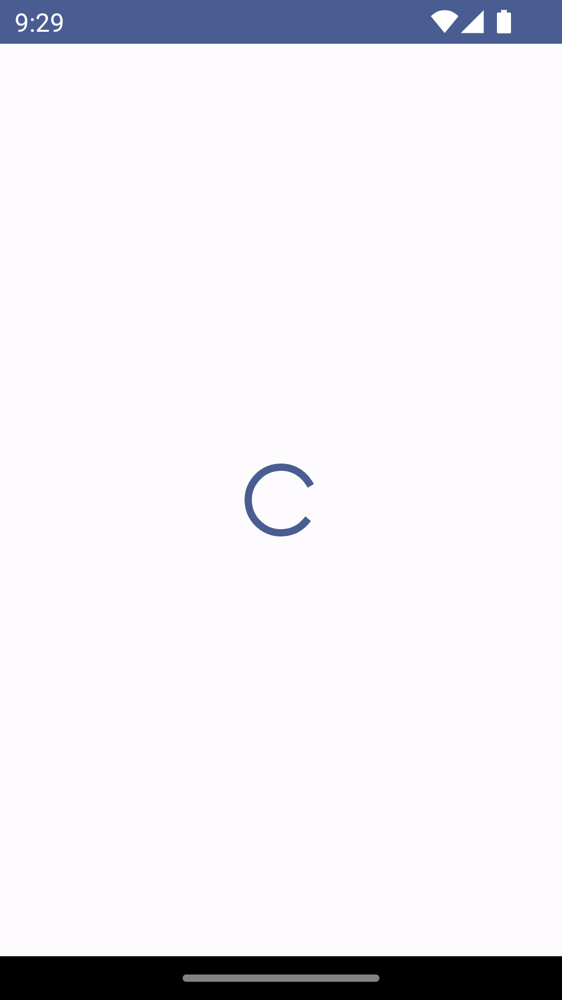
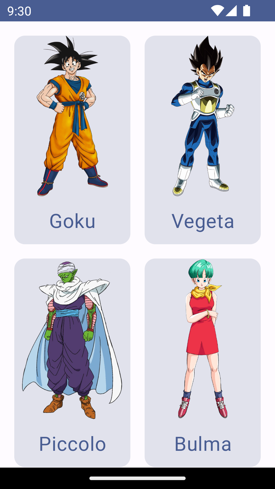
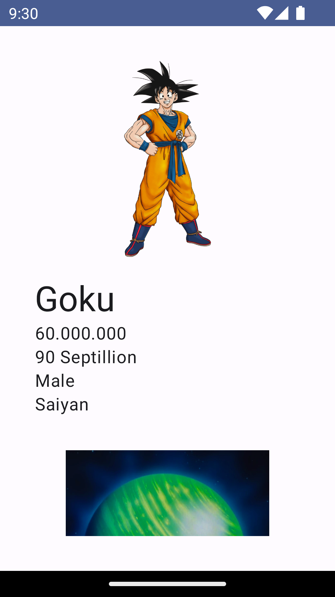
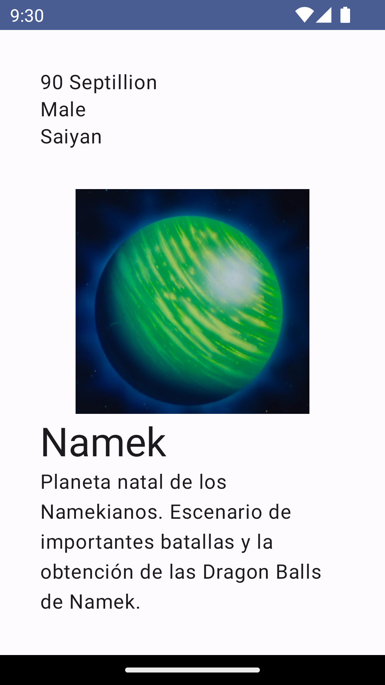

# DragonBall-Compose

DragonBall-Compose is a sample Android application built with Jetpack Compose, showcasing a UI that displays characters from the popular anime series Dragon Ball.

## Features

- Displays a list of Dragon Ball characters with their names and images.
- Allows users to click on a character to view additional details.

## Screenshots






## Getting Started

To get started with DragonBall-Compose, follow these steps:

1. Clone this repository to your local machine:

   ```bash
   git clone https://github.com/haldny/DragonBall-Compose.git
   ```

2. Open the project in Android Studio.

3. Build and run the project on an emulator or a physical device.

## Dependencies

- [Jetpack Compose](https://developer.android.com/jetpack/compose): Modern UI toolkit for building native Android UIs.
- [Coroutines](https://developer.android.com/kotlin/coroutines): For asynchronous programming.
- [Retrofit](https://square.github.io/retrofit/): For making network requests.
- [Coil](https://coil-kt.github.io/coil/compose/): For image loading and caching.

## Contributing

Contributions are welcome! If you find any bugs or have suggestions for improvements, feel free to open an issue or submit a pull request.

## License

This project is licensed under the MIT License. See the [LICENSE](LICENSE) file for details.
